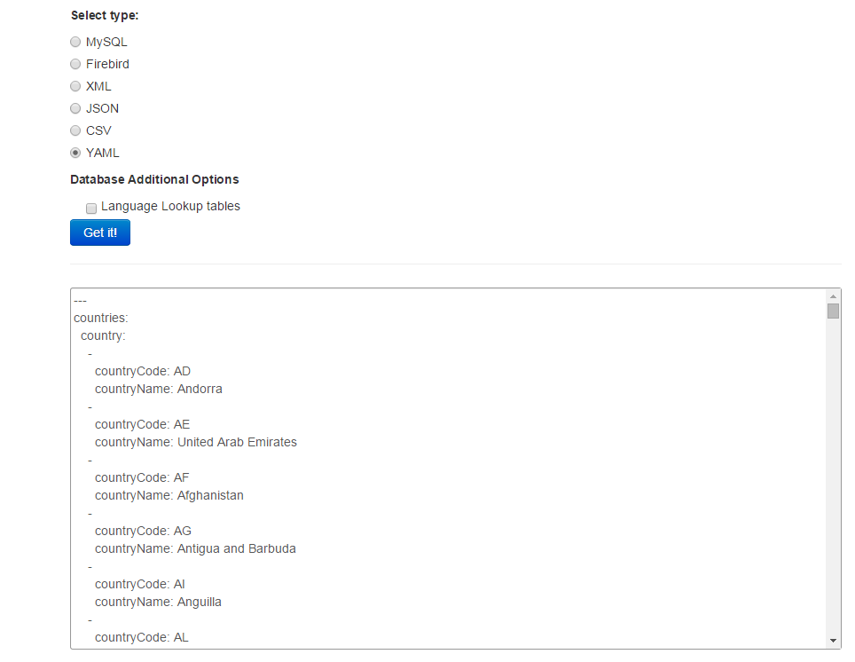
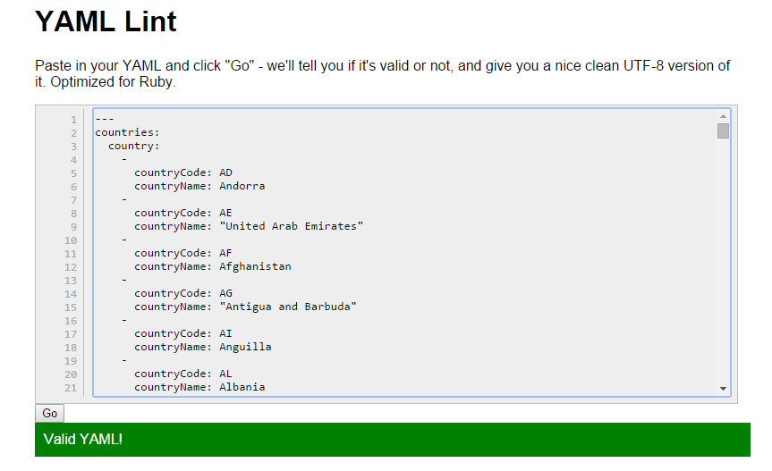

GetCountries
============

MySQL, Firebird, XML, JSON, CSV or YAML generator for custom Countries data. All the data is fetched from geonames.org

http://peric.github.com/GetCountries

<h2>Example</h2>
Here is a screenshot of the YAML generated output, having selected only <b>countryCode</b> and <b>countryName</b> columns:

  

To check if everything's fine, according to YAML's strict syntax, <a href="http://www.yamllint.com/>YAML Lint</a> is a good solution:

  

